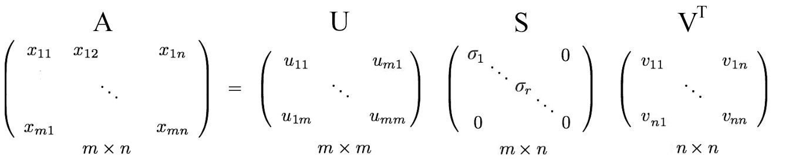

## Introduction

The first and arguably most important common denominator across all NLP tasks is how we represent words as input to any of our models. Much of the earlier NLP work that we will not cover treats words as atomic symbols. To perform well on most NLP tasks we first need to have some notion of similarity and difference between words. With word vectors, we can quite easily encode this ability in the vectors themselves (using distance measures such as Jaccard, Cosine, Euclidean, etc).

## Table of Contents

- [1. Basic Word Vectors](#Word-Vectors)

- [2. SVD Based Methods](#SVD-Based-Methods)
  - [2.1 Word-Document Matrix](#Word-Document_Matrix)
  - [2.2 Applying SVD to the cooccurrence matrix](#Applying-SVD-to-the-cooccurrence-matrix)
- [3. Iteration Based Method - Word2vec](#Iteration-Based-Method - Word2vec)
  - [3.1 Skip-Gram](#Skip-Gram)
  - [3.2 The skip-Gram model with Negative Sampling](#The-skip-Gram-model-with-Negative-Sampling)

- [4. GloVe (Global vectors for word representation)](#GloVe (Global vectors for word representation))
- [5. How to evaluate word vectors?](#How-to-evaluate-word-vectors?)
- [6. Improving Word Representations Via Global Context And Multiple Word Prototypes](#Improving-Word-Representations-Via-Global-Context-And-Multiple-Word-Prototypes)

​	

 

## Word-Vectors

There are an estimated 13 million tokens for the English language but are they all completely unrelated? Feline to cat, hotel to motel? I think not. Thus, we want to encode word tokens each into some vector that represents a point in some sort of "word" space. This is paramount for a number of reasons but the most intuitive reason is that perhaps there actually exists some N-dimensional space (such that N  13 million) that is sufficient to encode all semantics of our language. Each dimension would encode some meaning that we transfer using speech.

The first and most simple word vector / word representation would be **One-Hot Vector**. Represent every word as an R^VX1^. vector with all 0s and one 1 at the index of that word in the sorted english language. And |V| is the size of our vocabulary. 

We represent each word as a completely independent entity. As we previously discussed, this word representation does not give us directly any notion of similarity

## SVD-Based-Methods

For this class of methods to find word embeddings (otherwise known as word vectors), we first loop over a massive dataset and accumulate word co-occurrence counts in some form of a matrix X, and then perform Singular Value Decomposition on X to get a USV^T^ decomposition. We then use the rows of U as the word embeddings for all words in our dictionary. Let us discuss a few choices of X.

### Word-Document Matrix

As our first attempt, we make the bold conjecture that **words that are related will often appear in the same documents.** For instance, "banks", "bonds", "stocks", "money", etc. are probably likely to appear together. 

But "banks", "octopus", "banana", and "hockey" would probably not consistently appear together. We use this fact to build a `word-document matrix`, X in the following manner: 

	1. Loop over billions of documents
	1. for each time word i appears in document j, we add one to entry Xij. This is obviously a very large matrix (R^|V|×M^) 
	1. it scales with the number of documents (M). So perhaps we can try something better.

### Applying SVD to the cooccurence matrix

example for cooccurence matrix:

It's basically counting the number of times each word appears inside some input sentences

`Bag-of-words` : represent text using word frequencies, without context or order

Now we can apply `SVD` to the matrix, SVD gives you the whole nine-yard of diagonalizing a matrix into [special matrices](https://medium.com/@jonathan_hui/machine-learning-linear-algebra-special-matrices-c750cd742dfe) that are easy to manipulate and to analyze. It lay down the foundation to untangle data into independent components. 

Firts, Let's talk about how to calculate SVD

***Singular vectors & singular values***

The matrix **AAᵀ** and **AᵀA** are very special in linear algebra. Consider any m × n matrix **A**, we can multiply it with *Aᵀ* to form **AAᵀ** and **AᵀA** separately. These matrices are

- symmetrical,
- square,
- at least positive semidefinite (eigenvalues are zero or positive),
- both matrices have the same positive eigenvalues, and
- both have the same rank *r* as *A*.

u = **AAᵀ**, and v =  **AᵀA** , here we call these sets of eigenvectors u and v the singular vectors of A. Both matrices have the same positive **eigenvalues**. The square roots of these eigenvalues are called **singular values**

Since these vectors are orthonormal, it is easy to prove that *U* and *V* obey

Let’s start with the hard part first. SVD states that **any** matrix *A* can be factorized as:

where *U* and *V* are orthogonal matrices with orthonormal eigenvectors chosen from **AAᵀ** and **AᵀA** respectively. 

**S** is a diagonal matrix with *r* elements equal to the root of the positive eigenvalues of *AAᵀ* or *Aᵀ A* (both matrics have the same positive eigenvalues anyway). The diagonal elements are composed of singular values.

So if we want to reduce our dimension, we can remove some singular values, so some of U and V values won't be used. 

i.e. an m× n matrix can be factorized as:

[check the proof and example here](https://jonathan-hui.medium.com/machine-learning-singular-value-decomposition-svd-principal-component-analysis-pca-1d45e885e491#:~:text=we%20discussed%20before.-,Principal%20Component%20Analysis%20(PCA),factors%20(k%20principal%20components).)

**However**, running an `SVD` on raw counts won't work well, because function words (the, he, has , a) are too frequent -> syntax has too much impact

**Solution**: `COALS`

$e_{man} - e_{woman} ≈ e_{king} – e_{queen}$ , so if we want to find $e_{man} - e_{woman} ≈ e_{king} – e_?$ , we can calculate the property difference between king and other words.

$argmax\ 𝑤 \ 𝑠𝑖𝑚𝑖𝑙𝑎𝑟𝑖𝑡𝑦(𝑒_w,𝑒_{king}- e_{man}+e_{woman})$

with 

1. scaling the counts

   	- Log the frequencies

   	- Min(X,t) with t = 100

   	- Ignore the function words

2. Ramped windows that count closer words more than further words

3. Use Pearson correlations instead of counts, then set negative values to 0

[check applying SVD in to cooccurence matrix here](https://medium.com/analytics-vidhya/co-occurrence-matrix-singular-value-decomposition-svd-31b3d3deb305)

***Problems with SVD method***

1. The dimensions of matrix change very often because new words are added very frequently and corpus changes in size
2. The matrix is extremely sparse since most words do not cooccur
3. The matrix is very high dimensional
4. Quadratic cost to train
5. SVD based methods do not scale well for big matrices 

 

## Iteration Based Method - Word2vec

`Distribution Semantics` : A word's meaning is given by the words that freqeuntly appear near-by

When a word $w$ appears in a text, its context is the set of words that appear nearby. (within a fixed window)

So what exactly do we want to do with `word vectors(also called word embeddings or word representation)`?

we will build a dense vector for each word, chosen so that it is similar to vectors of words that appear in similar contexts

**`word2vec` is a framework for learning word vectors**

**idea:**

 - We have a large corpus of text
 - every word in a fixed vocab is represented by a **vector**
 - go through each position **t** in the text, which has a center word **c** and context words **o**
 - use the similarity of the word vectors for **c** and **o** to calculate the probability of o given c
 - Keep adjusting the word vectors to maximize this probability

### Skip-Gram

Skip-gram is one of the unsupervised learning techniques used to find the most related words for a given word(context word).

#### Objective Function

For each position t = 1,..T, predict context words within a window of fixed size m, given center word $w_j$ 

**by minimizing objective function <=> maximizing model accuracy**

#### Prediction Function

$P(o|c) = \frac{exp(u^o_tv_c)}{\sum_w exp(u^t_w v_c)}$

	- we use dot product because generally dot product compares similarity of o and c, so if two vectors both have positive values it will adds up to the sum, if one positive one negative, it will substract from the sum. **Larger dot product => larger probability**
	- The denominator normalize over entire vocabulary to give probability distribution

#### Train the model: Optimize value of parameters to minimize loss

To train the model, we gradually adjust parameters to minimize a loss

$\theta$ represents **all** the model parameters , in one long vector, so we only have one long vector for all words in our context. And every word will have two vectors, v(use when the word used as center word), and u(use when the word used as context word)

#### Optimization: Gradient Descent

We have a loss function $J(\theta)$ to minimize. And we can use `Gradient Descent` to do that

1. for current value of $\theta$, calculate gradient of $J(\theta)$, then take **small step in direction of negative gradient** -> update $\theta$

   **Update equation**

   $\theta = \theta - \alpha * \frac{\mathrm d}{\mathrm d \theta} \big(  J(\theta) \big)$

2. Repeat until we find the global minimum

In practice, we can choose SGD, mini-batch SGD etc

But one more question would be, how to choose the context words to train? Obviously we don't want to choose those **common words** like as, in ,a an ...

### The skip-Gram model with Negative Sampling

**Main Idea**: train binary logistic regressions for a true pair (center word and a word in its context window) versus several “noise” pairs (the center word paired with a random word)

**Steps**

1. sample some context words, like “orange”
2. Find a target word for it, and label it as 1. ie, words are within the target window, such as "juice"

3. Find **k** non-target words, label them as 0. Non- target words are generated by randomly selected in the example. If we accidentally selected words within the window, such as "of", it's fine

1. Generated supervised learning, with (context, word) as pairs input, and predict target as y. the problem is, given a pair of words, predict if they are near each other.
2. K = 5-20 for smaller data, k = 2-5 for larger data

In skip-gram, the output will be 10,000 dimensional for 10,000 vocab size, but for negative sampling, for each iteration, instead of training all words in the dictionary and find its probability of being target word, we only train k+1 words, k non-target words, and 1 target words.

#### Selecting Negative samples

The non-target words are called negative samples, are usually sampled using a “unigram distribution”, where more frequent words are more likely to be selected as negative samples. But the downside would be, it will easily choose those “an, a , the” (stop words). So with some modification, the probability of choosing the word as negative samples is expressed as :

#### Objective Function

Generally, we want to minimize our objective function with negative logs, so we rewrite our objective function as 

So we want to maximize probability that real target word appears($u^T_o v_c$), and minimize probability that random words appear around center word($u^T_k v_c$)

 

## GloVe (Global vectors for word representation)

It is an **unsupervised** learning algorithm developed by Stanford for generating word embeddings by aggregating global word-word co-occurrence matrix from a corpus. Combines both global and local word co-occurence data to learn word similarity

**Crucial Insight**: Ratios of co-occurrence probabilities can encode meaning components(probability of i given j)

But how do we represent it in a word vector space?

**With a Log-Bilinear model**: $w_i \cdot w_j = log(P(i|j))$-> generally, we assume the dot product of two vectors can represent the log conditional probability

Then we can extend this to vector differences 

 $w_x \cdot (w_a-w_b) = log(\frac{P(x|a)}{P(x|b)})$

 $x_{i,j} = number \ of \ times \ j \ appears \ in \ context \ of \ i$

i = the context word, j is the center word

**Objective Function**

b as bias params

This function minimizes the difference between (how related are two words) with (how often they appear near each other)

Since we don't want very high frequency word dominates, so we capped the effect of high word counts using f function 

Here f is a weighting function that acts to **reduce the impact of frequent co-occurring terms** which is a drawback discussed above. The function f is constructed using 3 properties.

1. It should be a continuous function which vanishes as ***x →\*** 0.

2. It should be non decreasing.

3. It should output relatively small values for large values of ***x\***.

    

## How to evaluate word vectors?

**Intrinsic:**

	- Evaluation on a specific/intermediate subtask
	- Fast to compute
	- Helps to understand that system
	- Not clear if really helpful unless correlation to real task is established

**Extrinsic:**

	- Evaluation on a real task
	- Can take a long time to compute accuracy
	- Unclear if the subsystem is the problem or its interaction or other subsystems
	- If replacing exactly one subsystem with another improves accuracy -> Winning!

 

## Improving Word Representations Via Global Context And Multiple Word Prototypes

Most words have **lots of meanings!** • Especially common words • Especially words that have existed for a long time

**Idea**:

1. Cluster word windows around words, retrain with each word assigned to multiple different clusters bank1, bank2, etc.

2. Different senses of a word reside in a linear superposition (weighted sum) in standard word embeddings like word2vec

   for example:

   $v_{pike} = \alpha_1 v_{pike1} + \alpha_2 v_{pike2} +\alpha_3 v_{pike3}$

   where $\alpha1 = \frac{f_1}{f_1+f_2+f_3}$ , f as frequency

   

